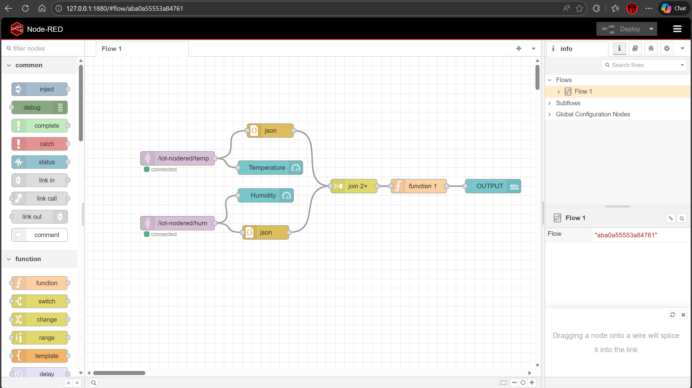
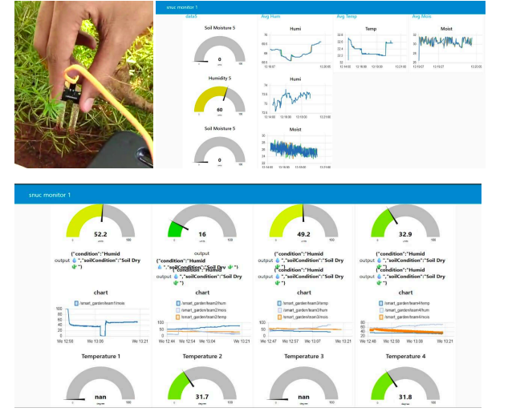
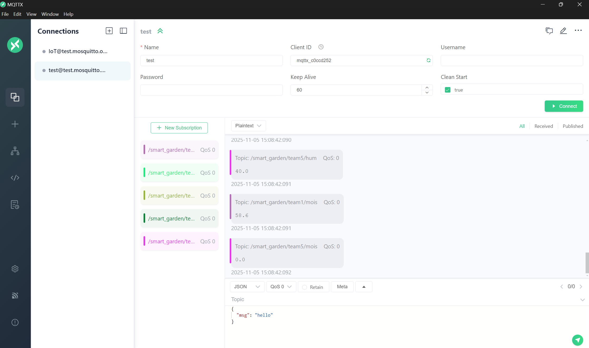
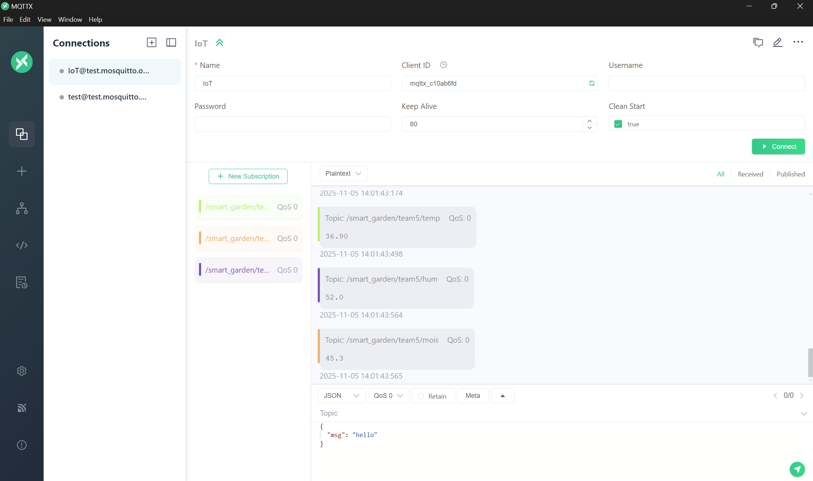

# 🌱 GreenPulse: Smart Garden Monitoring System

## 📌 Overview

**GreenPulse: Smart Garden Monitoring System** is a real-time monitoring application designed to track and visualize environmental conditions affecting plant growth. The system consists of **5 ESP32 sensor nodes** (one per team) that collect temperature, humidity, and soil moisture data, publish it to an MQTT broker, and visualize it through a Node-RED web dashboard.

This project demonstrates the use of **real-time data pipelines**, **event-driven communication**, and **interactive dashboards** to support informed plant care and irrigation decisions.

---

## 🎯 Objectives

* Monitor soil moisture levels to understand irrigation needs
* Track ambient temperature and humidity to assess environmental conditions
* Enable real-time visualization of sensor data from multiple teams
* Build a scalable and low-latency data communication pipeline
* Provide actionable insights for maintaining plant health

---

## 🛠️ Tech Stack

### Hardware
* **ESP32 Development Boards** (5 units)
* **DHT11 Sensor** – Temperature and Humidity measurement
* **Soil Moisture Sensor** – Analog water content measurement

### Software
* **Arduino IDE** – ESP32 firmware development
* **MQTT** – Lightweight messaging protocol for real-time data communication
* **Node-RED** – Flow-based development tool for data processing and dashboard creation
* **MQTT Broker** – test.mosquitto.org (public test broker)

### Libraries
* **WiFi** (ESP32 built-in)
* **PubSubClient** by Nick O'Leary
* **DHT sensor library for ESPx** by beegee-tokyo

---

## 🏗️ System Architecture

### Overview

GreenPulse: Smart Garden Monitoring System is a distributed IoT solution that collects environmental data from multiple sensor nodes and visualizes it in real-time through a web-based dashboard.

### System Components

#### 1. Sensor Nodes (ESP32)
- **Quantity:** 5 nodes (one per team)
- **Function:** Collect sensor data and publish to MQTT broker
- **Sensors:**
  - DHT11: Temperature and Humidity
  - Soil Moisture Sensor: Analog moisture level
- **Publishing Frequency:** Every 2 seconds

#### 2. Communication Layer (MQTT)
- **Protocol:** MQTT (Message Queuing Telemetry Transport)
- **Broker:** test.mosquitto.org (public test broker)
- **Purpose:** Lightweight, low-latency message exchange
- **QoS Level:** 0 (at most once delivery)

#### 3. Visualization Layer (Node-RED)
- **Function:** Subscribe to MQTT topics and display data
- **Dashboard:** Web-based UI with gauges and charts
- **Features:** Real-time updates, historical trends

### Data Flow Architecture

```
┌─────────────────┐
│   ESP32 Node 1  │──┐
│  (Team 1)       │  │
│  - DHT11        │  │
│  - Soil Sensor  │  │
└─────────────────┘  │
                     │
┌─────────────────┐  │
│   ESP32 Node 2  │──┤
│  (Team 2)       │  │
└─────────────────┘  │
                     │
┌─────────────────┐  │      ┌──────────────┐      ┌──────────────┐
│   ESP32 Node 3  │──┤      │              │      │              │
│  (Team 3)       │  │      │   MQTT       │      │   Node-RED   │
└─────────────────┘  ├──────│   Broker     │──────│   Dashboard  │
                     │      │              │      │              │
┌─────────────────┐  │      │              │      │              │
│   ESP32 Node 4  │──┤      └──────────────┘      └──────────────┘
│  (Team 4)       │  │            │                      │
└─────────────────┘  │            │                      │
                     │            │                      │
┌─────────────────┐  │            │                      │
│   ESP32 Node 5  │──┘            │                      │
│  (Team 5)       │               │                      │
└─────────────────┘               │                      │
                                  │                      │
                            ┌─────▼─────┐         ┌──────▼────┐
                            │  WiFi     │         │  Web      │
                            │  Network  │         │  Browser  │
                            └───────────┘         └───────────┘
```

### Data Processing Pipeline

1. **Data Collection**
   - Frequency: Every 2 seconds
   - Sensors: DHT11 (temperature, humidity), Soil moisture (analog)
   - Format: Raw sensor readings

2. **Data Conversion**
   - Temperature: Float to string (2 decimal places)
   - Humidity: Float to string (1 decimal place)
   - Soil Moisture: Analog reading (0-4095) → Percentage (0-100%)

3. **Data Transmission**
   - Protocol: MQTT over WiFi
   - Topic: Team-specific topics (`/smart_garden/team{X}/{sensor_type}`)
   - Payload: String representation of sensor value

4. **Data Reception**
   - Subscriber: Node-RED MQTT input nodes
   - Processing: Parse string to numeric value
   - Storage: In-memory for chart history (1 hour)

5. **Data Visualization**
   - Gauges: Current value with color-coded thresholds
   - Charts: Time-series line graphs
   - Update: Real-time (every 2 seconds)

### Software Architecture

#### ESP32 Firmware Structure
```
teamX.ino
├── Includes & Libraries
│   ├── WiFi.h
│   ├── PubSubClient.h
│   └── DHTesp.h
│
├── Configuration
│   ├── Pin Definitions
│   ├── WiFi Credentials
│   ├── MQTT Settings
│   └── Team ID
│
├── Global Objects
│   ├── DHTesp dht
│   ├── WiFiClient espClient
│   └── PubSubClient client
│
├── Functions
│   ├── setup_wifi()
│   ├── mqtt_callback()
│   ├── reconnect_mqtt()
│   └── publish_sensor_data()
│
└── Main Loop
    ├── Connection Management
    └── Data Publishing
```

#### Node-RED Flow Structure
```
MQTT Input Nodes (15 total)
├── Team 1: temp, hum, mois
├── Team 2: temp, hum, mois
├── Team 3: temp, hum, mois
├── Team 4: temp, hum, mois
└── Team 5: temp, hum, mois
         │
         ├── Gauge Nodes (15 total)
         │   └── Real-time value display
         │
         └── Chart Nodes (15 total)
             └── Historical trend visualization
```

---

## 📂 Project Structure

```
plant-health-monitoring-system/
│
├── team1.ino             # ESP32 code for Team 1
├── team2.ino             # ESP32 code for Team 2
├── team3.ino             # ESP32 code for Team 3
├── team4.ino             # ESP32 code for Team 4
├── team5.ino             # ESP32 code for Team 5
├── flows.json            # Node-RED flow configuration (actual implementation)
├── node-red-flows.json   # Node-RED dashboard flow configuration (5-team setup)
├── data.json             # Collected sensor data from MQTT
├── nodered-flow.png      # Node-RED flow diagram
├── nodered-dashboard.png # Dashboard screenshot
├── all-teams-data.png    # All teams data visualization
├── team-5-data.png       # Team 5 data example
├── REPORT.pdf            # Project report
└── README.md             # This file
```

### Code Features

**ESP32 Code Features:**
✅ Modular, well-documented code  
✅ Proper error handling  
✅ Automatic WiFi reconnection  
✅ Automatic MQTT reconnection  
✅ Configurable publishing interval  
✅ Serial debugging output  
✅ LED indicator for data transmission  
✅ Sensor error detection  

**Node-RED Dashboard Features:**
✅ Real-time data visualization  
✅ Historical trend charts  
✅ Color-coded gauges with thresholds  
✅ Separate tabs for each team  
✅ Automatic updates  
✅ Responsive layout  

---

## 📡 MQTT Topic Design

### Topic Naming Convention
```
/smart_garden/{team_id}/{sensor_type}
```

### Available Topics

**Team 1:**
- `/smart_garden/team1/temp` - Temperature (°C)
- `/smart_garden/team1/hum` - Humidity (%)
- `/smart_garden/team1/mois` - Soil Moisture (%)

**Team 2:**
- `/smart_garden/team2/temp` - Temperature (°C)
- `/smart_garden/team2/hum` - Humidity (%)
- `/smart_garden/team2/mois` - Soil Moisture (%)

**Team 3:**
- `/smart_garden/team3/temp` - Temperature (°C)
- `/smart_garden/team3/hum` - Humidity (%)
- `/smart_garden/team3/mois` - Soil Moisture (%)

**Team 4:**
- `/smart_garden/team4/temp` - Temperature (°C)
- `/smart_garden/team4/hum` - Humidity (%)
- `/smart_garden/team4/mois` - Soil Moisture (%)

**Team 5:**
- `/smart_garden/team5/temp` - Temperature (°C)
- `/smart_garden/team5/hum` - Humidity (%)
- `/smart_garden/team5/mois` - Soil Moisture (%)

### Message Format
Each team publishes three types of sensor data:
- **Temperature:** Numeric string (e.g., "25.50") in degrees Celsius
- **Humidity:** Numeric string (e.g., "65.0") as percentage
- **Soil Moisture:** Numeric string (e.g., "45.2") as percentage

---

## 📈 Dashboard Design

The Node-RED dashboard includes separate tabs for each of the 5 teams:

**Per Team Display:**
* **Temperature Gauge** – Current temperature with color-coded thresholds (0-50°C)
* **Temperature Chart** – Historical temperature trends
* **Humidity Gauge** – Current humidity level (0-100%)
* **Humidity Chart** – Historical humidity trends
* **Soil Moisture Gauge** – Current soil moisture percentage (0-100%)
* **Soil Moisture Chart** – Historical moisture trends

The dashboard updates automatically every 2 seconds as new data arrives from all teams.

### Node-RED Flow Implementation

The project includes a complete Node-RED flow configuration (`flows.json`) that:
- Subscribes to MQTT topics for temperature and humidity
- Processes sensor data with conditional logic
- Displays real-time gauges for temperature and humidity
- Shows environmental condition status (Hot, Cold, Comfort, Dry, Humid)
- Connects to the MQTT broker at `test.mosquitto.org`

**Node-RED Flow Diagram:**


### Dashboard Screenshots

**Node-RED Dashboard Overview:**


**All Teams Data Visualization:**


**Team 5 Data Example:**


---

## 🚀 Setup & Installation

### Prerequisites

#### Hardware Requirements
- 5x ESP32 Development Boards
- 5x DHT11 Temperature & Humidity Sensors
- 5x Soil Moisture Sensors (Analog)
- Jumper wires and breadboards
- USB cables for programming ESP32

#### Software Requirements
- Arduino IDE (with ESP32 board support)
- Node-RED (for dashboard)
- MQTT Broker (test.mosquitto.org is used by default)

---

### ESP32 Setup

#### 1. Install Arduino IDE
Download and install Arduino IDE from: https://www.arduino.cc/en/software

#### 2. Install ESP32 Board Support
1. Open Arduino IDE
2. Go to **File → Preferences**
3. In "Additional Board Manager URLs", add:
   ```
   https://raw.githubusercontent.com/espressif/arduino-esp32/gh-pages/package_esp32_index.json
   ```
4. Go to **Tools → Board → Boards Manager**
5. Search for "ESP32" and install "esp32 by Espressif Systems"

#### 3. Install Required Libraries
Install the following libraries via **Tools → Manage Libraries**:
- **WiFi** (usually included with ESP32)
- **PubSubClient** by Nick O'Leary
- **DHT sensor library for ESPx** by beegee-tokyo

#### 4. Configure WiFi Credentials
Edit each team file (`team1.ino` through `team5.ino`) and update:
```cpp
const char* ssid = "YOUR_WIFI_SSID";
const char* password = "YOUR_WIFI_PASSWORD";
```

#### 5. Upload Code to ESP32
1. Connect ESP32 via USB
2. Select board: **Tools → Board → ESP32 Arduino → ESP32 Dev Module**
3. Select port: **Tools → Port → [Your ESP32 Port]**
4. Open the appropriate team file (e.g., `team1.ino`)
5. Click **Upload** button
6. Repeat for all 5 ESP32 boards with their respective team files

#### 6. Verify Serial Output
Open Serial Monitor (115200 baud) to verify:
- WiFi connection successful
- MQTT connection successful
- Sensor readings being published every 2 seconds

---

### Node-RED Dashboard Setup

#### 1. Install Node-RED
```bash
npm install -g node-red
```

Or use Docker:
```bash
docker run -it -p 1880:1880 --name node-red nodered/node-red
```

#### 2. Install Node-RED Dashboard
1. Start Node-RED: `node-red`
2. Open browser: http://localhost:1880
3. Click **☰ Menu → Manage Palette**
4. Go to **Install** tab
5. Search and install: **node-red-dashboard**

#### 3. Import Flow
You can import either flow file:
- **`flows.json`** - Actual implementation flow with temperature/humidity processing
- **`node-red-flows.json`** - Complete 5-team dashboard setup

To import:
1. In Node-RED, click **☰ Menu → Import**
2. Copy and paste contents of the desired flow file
3. Click **Deploy** button

#### 4. Access Dashboard
Open browser: http://localhost:1880/ui

You should see:
- 5 tabs (one for each team)
- Each tab showing:
  - Temperature gauge and chart
  - Humidity gauge and chart
  - Soil moisture gauge and chart

---

## 🔌 Hardware Connections

### ESP32 Pin Configuration

**DHT11 Sensor:**
- VCC → 3.3V
- GND → GND
- DATA → GPIO 15

**Soil Moisture Sensor:**
- VCC → 3.3V or 5V
- GND → GND
- A0 → GPIO 34 (Analog input)

**LED (Built-in):**
- GPIO 2 (indicates data transmission)

**Note:** Same pin configuration for all 5 ESP32 boards.

---

## ⚙️ Configuration Options

### Change Publishing Interval
In each team file, modify:
```cpp
const unsigned long publish_interval = 2000; // milliseconds
```

### Use Different MQTT Broker
Update in each team file:
```cpp
const char* mqtt_server = "your-broker-address";
const int mqtt_port = 1883;
```

### Adjust Sensor Thresholds
In Node-RED dashboard, modify gauge ranges:
- **Temperature:** 0-50°C (segments at 25°C and 35°C)
- **Humidity:** 0-100% (segments at 30% and 70%)
- **Soil Moisture:** 0-100% (segments at 30% and 70%)

---

## 🧪 Testing

### Test Individual Sensors
1. Upload code to ESP32
2. Open Serial Monitor (115200 baud)
3. Verify sensor readings appear every 2 seconds

### Test MQTT Publishing
Use MQTT client (e.g., MQTT Explorer) to subscribe to topics:
```
/smart_garden/team1/#
```
You should see messages arriving every 2 seconds.

### Test Dashboard
1. Ensure all ESP32 devices are running
2. Open Node-RED dashboard
3. Verify all gauges and charts update in real-time

### Testing Checklist
- [ ] All 5 ESP32 boards upload successfully
- [ ] WiFi connection established on all boards
- [ ] MQTT connection successful on all boards
- [ ] Sensor readings appear in Serial Monitor
- [ ] MQTT messages visible in MQTT client
- [ ] Node-RED dashboard displays all teams
- [ ] Gauges update in real-time
- [ ] Charts show historical data
- [ ] All 15 data streams working (5 teams × 3 sensors)

---

## 🔧 Troubleshooting

### ESP32 Not Connecting to WiFi
- Verify SSID and password are correct
- Check WiFi signal strength
- Ensure 2.4GHz WiFi (ESP32 doesn't support 5GHz)
- Check Serial Monitor for error messages

### MQTT Connection Failed
- Verify internet connection
- Check if `test.mosquitto.org` is accessible
- Try alternative MQTT broker if needed
- Check firewall settings
- Verify MQTT broker port (1883)

### No Data in Dashboard
- Verify ESP32 is publishing data (check Serial Monitor)
- Check Node-RED flow is deployed
- Verify MQTT broker configuration in Node-RED
- Check browser console for errors
- Ensure Node-RED dashboard nodes are installed

### Sensor Readings Incorrect
- Verify sensor connections
- Check pin numbers match code
- Calibrate soil moisture sensor if needed
- Ensure DHT11 has proper pull-up resistor (usually built-in)
- Check sensor power supply (3.3V or 5V)

---

## 📊 Performance Metrics

### Expected Performance
- **Latency:** < 100ms (WiFi + MQTT)
- **Throughput:** ~15 messages/second (5 teams × 3 sensors)
- **Reliability:** ~99% message delivery (depends on network)

### Resource Usage
- **ESP32 RAM:** ~50KB (out of 520KB)
- **ESP32 Flash:** ~1MB (out of 4MB)
- **Node-RED Memory:** ~50-100MB
- **Network Bandwidth:** ~1KB/second per node

---

## 🔒 Security Considerations

### Current Implementation
- **WiFi:** WPA2 encryption (handled by router)
- **MQTT:** Unencrypted (public test broker)
- **No Authentication:** Public broker doesn't require credentials

### Production Recommendations
- **MQTT over TLS:** Encrypt MQTT traffic
- **MQTT Authentication:** Username/password or certificates
- **Private Broker:** Self-hosted MQTT broker
- **Network Isolation:** Separate IoT network (VLAN)
- **Data Encryption:** Encrypt sensitive sensor data

---

## 🚀 Future Enhancements

* Add light intensity sensors
* Implement alert notifications for critical conditions
* Store historical data in a database for long-term analysis
* Integrate predictive analytics for irrigation recommendations
* Add mobile app for remote monitoring
* Implement MQTT authentication and encryption for production use
* Dynamic team addition (configuration-based team management)
* Alert system with threshold-based notifications

---

## 📊 Data Collection

The project includes collected sensor data stored in `data.json`. This file contains:
- MQTT client configuration
- Subscription data from various sensor topics
- Historical sensor readings from the monitoring period
- Connection metadata and timestamps

The data demonstrates the real-world operation of the system with actual sensor readings from the ESP32 nodes publishing to the MQTT broker.

---

## 🔍 Use Cases

* Home gardening and smart plant care
* Greenhouse environment monitoring
* Educational projects for real-time systems and dashboards
* Prototype for smart agriculture applications
* Multi-team IoT project demonstrations
* Real-time environmental data collection and analysis

---

## 🧠 Key Learnings

* Designing real-time, event-driven systems
* Working with MQTT for low-latency data transfer
* Building interactive dashboards using Node-RED
* Structuring scalable data flows for continuous monitoring
* Implementing distributed sensor networks
* Error handling and automatic reconnection strategies

---

## 📄 License

MIT License

Copyright (c) 2026 GreenPulse: Smart Garden Monitoring System

Permission is hereby granted, free of charge, to any person obtaining a copy
of this software and associated documentation files (the "Software"), to deal
in the Software without restriction, including without limitation the rights
to use, copy, modify, merge, publish, distribute, sublicense, and/or sell
copies of the Software, and to permit persons to whom the Software is
furnished to do so, subject to the following conditions:

The above copyright notice and this permission notice shall be included in all
copies or substantial portions of the Software.

THE SOFTWARE IS PROVIDED "AS IS", WITHOUT WARRANTY OF ANY KIND, EXPRESS OR
IMPLIED, INCLUDING BUT NOT LIMITED TO THE WARRANTIES OF MERCHANTABILITY,
FITNESS FOR A PARTICULAR PURPOSE AND NONINFRINGEMENT. IN NO EVENT SHALL THE
AUTHORS OR COPYRIGHT HOLDERS BE LIABLE FOR ANY CLAIM, DAMAGES OR OTHER
LIABILITY, WHETHER IN AN ACTION OF CONTRACT, TORT OR OTHERWISE, ARISING FROM,
OUT OF OR IN CONNECTION WITH THE SOFTWARE OR THE USE OR OTHER DEALINGS IN THE
SOFTWARE.

---